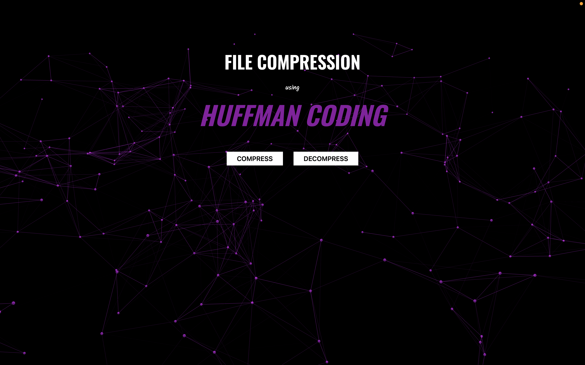
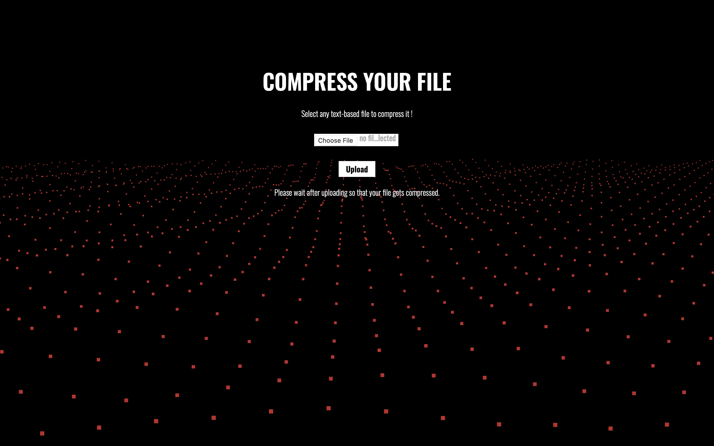
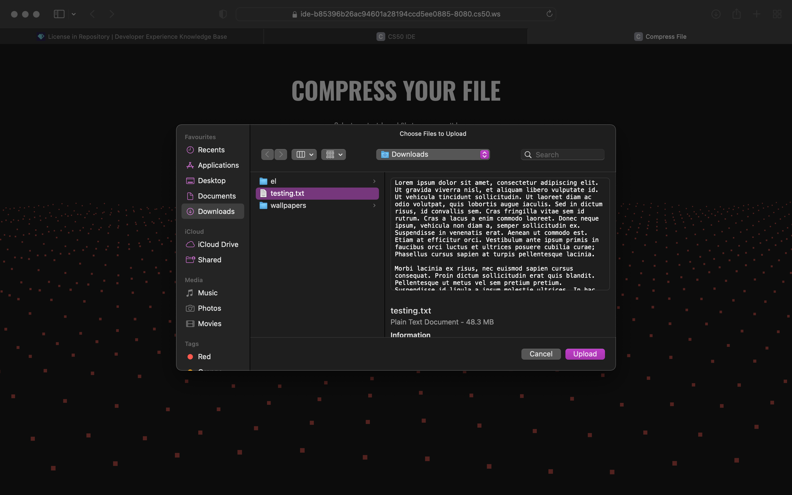
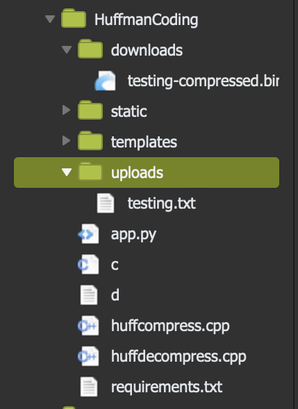
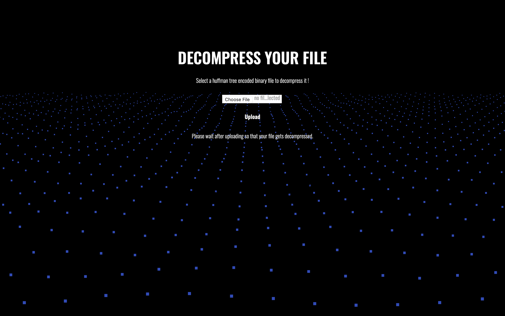
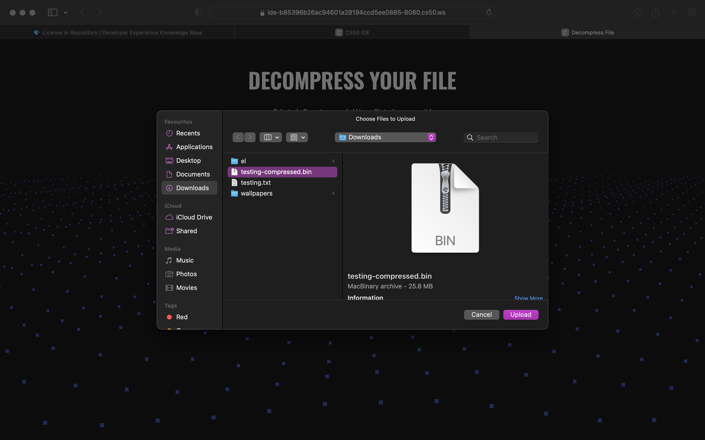
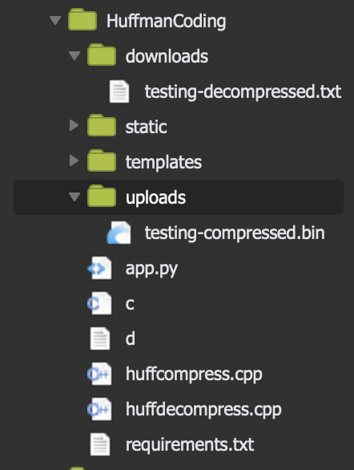

# File Compression Using Huffman Coding

## Website hosted here ----> (https://huffman-app.herokuapp.com)


### A file compressing (and decompressing) web application designed using the concept of Huffman Coding.



## Introduction
Huffman Coding is a lossless data compression algorithm where variable length prefix codes are assigned to the characters used in the file. Prefix codes are those that won't form the prefix of any other code assigned to the other characters of the file. In Huffman Coding, these prefix codes (which are unique to each distinct character) are assinged in an efficient way such that the most frequently occuring character gets the smallest prefix code. 



By doing this, we are able to represent a character in possibly <strong>less than 8 bits or 1 byte</strong> therefore reducing the size of the compressed file. In order to assign these codes, a huffman tree is generated and written into the compressed file so that it can be decompressed later from the information available in this tree. For every <strong>left sub-tree we move into, we take 0 and similarly 1 for the right subtree</strong> until we reach a node that has a character (not an internal node).  More on [Huffman Coding](https://www.geeksforgeeks.org/huffman-coding-greedy-algo-3/). This application can be used to compress any text based file i.e files with extensions like ```.txt```, ```.c```, ```.cpp```, ```.html```, ```.js```, ```.docx``` and so on!




## Working
The following steps are followed to build and traverse the <strong>HUFFMAN TREE</strong>
<ol>
  <li>Find the frequency of each unique character present in the input file and maintain a hashmap.</li>
  <li>Create a minheap based on the frequencies of characters found out in the previous step. This minheap acts as a priority queue wherein the node containing the character with the least frequency is present at the root (is the root node). The number of independent nodes in this minheap will be equal to the number of unique character present in the input file.</li>
  <li>Until the number of independent nodes of minheap (it's size) becomes 1, -> keep popping 2 nodes one after the other from the minheap and create a parent node for these nodes -> the first popped node becoming the left child and then  -> insert the parent node back into the minheap and run the heapify function.</li>
  <li>Now traverse the Huffman Tree in such a way that for every left, take 0 and similarly 1 for right until we reach a node having a character (or a leaf node which won't be having children. The string of 0s and 1s generated now becomes the prefix code of the character. </li>
  <li>Create a hashmap mapping each character with its prefix code and this hashmap is written at the start of the compressed/encoded file.</li>
</ol>



It is important to ensure the number of bits in the string produced by replacing each character with its code is a multiple of 8 so that we can now read 8 bits at a time, get its decimal equivalent and the coresponding ascii equivalent character is finally written to the compressed file. This is where the actual compression takes place and the compressed file generated is smaller than the input file.<br>




#### Note : 
The size of the input file must be big enough ( <strong>> 500 bytes</strong>) to notice the size difference. A very small input file if encoded/compressed would otherwise result in a bigger compressed file owing to the additional contents of the hashmap written at the beginning (which would surpass the reduction in size obtained by replacing characters with prefix codes). This should be avoided as there is not point in having a compression algorithm if the input file is so small.

## Results
To test the compression algorithm, I have used a randomly generated ```testing.txt``` file which is around <strong>48.3 Mb</strong> in size. Upon uploading this file and downloading the compressed ```.bin``` file i.e ```testing-compressed.bin```, we can see that there is around <strong>47 %</strong> reduction in size of the input file (48.3 Mb to 25.8 Mb). This file is now decompressed and the ```testing-decompressed.txt``` file is obtained which is exactly <strong>48.3 Mb</strong> in size and retains all the original contents of ```testing.txt``` without any loss in data. Hence the name Lossless Data Compression Algorithm.


## Conclusion
We can arrive at the conclusion that this lossless data compression algorithm based on HUFFMAN CODING is one of the most efficient ways of encoding and compressing data. Using this, we are able to represent characters that occur more frequently with possibly lesser than 8 bits or 1 byte. Therefore, the number of bits saved by these characters greatly surpasses the extra bits which might possibly be used to represent characters that occur very rarely. This causes the compressed file to occupy (in best cases) less than 50 percent of the original file size that too without losing any kind of data !
